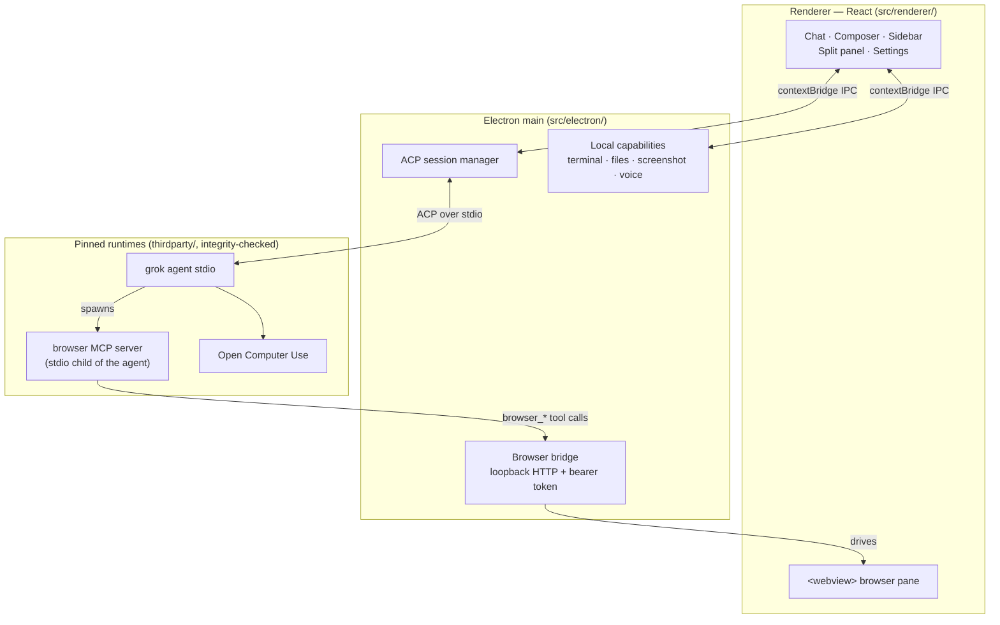

<h1 align="center">Grok Build GUI</h1>

<p align="center">
  A desktop <strong>control plane</strong> for
  <a href="https://x.ai/cli">Grok Build</a>, speaking
  <a href="https://agentclientprotocol.com">ACP</a> to a local <code>grok agent</code>.
</p>

<p align="center">
  <a href="LICENSE"></a>
  
  
  
</p>

<p align="center">
  <strong>English</strong> ·
  <a href="README.zh-CN.md">简体中文</a>
</p>

---

Grok Build ships as a terminal agent. This app puts a real desktop UI in front of
it — a session sidebar, a streaming transcript with tool cards, a permission
modal, an embedded browser the agent can drive, a terminal, and a file tree —
without reimplementing the agent itself.

**It is a client, not a second agent.** The app restores a pinned,
integrity-checked `grok` executable, spawns `grok agent stdio`, and drives every
session over ACP. The agent stays the single source of truth for sessions,
tools, and loops; the GUI owns presentation, local OS capabilities, and the
human-approval surface that ACP asks for.

## Features

### Conversation

- **Streaming transcript** with per-turn navigation, a turn rail, and
  rewind-to-here.
- **Tool cards** that expand into arguments, results, and unified diffs, with a
  file-change bar summarising what a turn touched.
- **Process folds** collapse long tool chatter so the reasoning stays readable.
- **Markdown + syntax highlighting**, inline image attachments, and a lightbox.
- **Prompt queue** — keep typing while a turn runs and queue follow-ups, or
  interject mid-turn.
- **Context meter** breaking the window into cached prefix, new input, reply,
  thinking tokens, and free space.

### Agent control

- **Permission modal** implementing the ACP `request_permission` reverse-request:
  the agent asks, you allow or deny, per call.
- **Permission modes** from ask-for-approval through full access (YOLO), chosen
  in the composer and visible at all times.
- **Model and reasoning-intensity pickers**, populated by capability probe
  rather than hardcoded version folklore.
- **Slash commands and skills** — `/browser`, `/computer`, `/goal`, plus whatever
  the connected agent and its plugins expose.
- **Cancel** any in-flight turn.

### Built-in browser the agent can drive

A `<webview>` pane sits beside the chat, and the app exposes it to the agent as
an MCP tool server: `browser_open`, `browser_navigate`, `browser_snapshot`,
`browser_click`, `browser_fill`, `browser_press_key`, `browser_scroll`,
`browser_screenshot`, `browser_wait_for`.

You watch every action happen. Filling a `type="password"` field always stops
for explicit approval, and the secret is redacted out of the permission payload
before it is shown or logged.

### Local capabilities

- **Terminal** — real PTY sessions (`node-pty` + xterm.js), with a configurable
  shell and light/dark theme.
- **File tree and viewer** with a context menu, reveal-in-Finder, and open-with.
- **Screen capture** — full screen, window, or drag-selected region (including
  multi-region), with an editor, straight into the composer as an attachment.
- **Voice input** — push-to-talk speech-to-text with a selectable speech
  language.
- **Side tasks** and a split panel, so a terminal, a file, or a second task can
  sit next to the conversation.

### Sessions and workspaces

- **Sessions grouped by project**, searchable, renameable, resumable, with
  history streamed back in on load.
- **Git worktree isolation** — start a chat on its own worktree from any branch
  so the agent's edits never touch your working copy; the app tracks status and
  cleans up.
- **Workspace picker** with recent projects and throwaway task workspaces.

### Account and platform

- **Grok sign-in** via the CLI's OAuth flow, with account and usage/quota
  display.
- **Plugin management** — list, install, enable, disable, uninstall.
- **Interface language**: English and Simplified Chinese, or follow the system.
- **Auto-update** from GitHub Releases or any static feed, opt-in per build.
- **System proxy detection**, persisted window state, and a native app menu.

## Architecture



**Renderer → main.** The renderer holds no privileged handles. Everything —
agent prompts, terminal bytes, file reads, screen capture — crosses a
`contextBridge` preload surface into the main process.

**Main → agent.** The main process spawns the pinned `grok agent stdio` and
speaks ACP over its stdio pipes. Session state, tool execution, and goal loops
live in the agent; the GUI renders updates and answers permission requests.

**Agent → browser.** The main process starts a loopback HTTP bridge on a random
port with a random 32-byte bearer token, then hands the agent an MCP server
descriptor. The agent spawns that MCP server as its own stdio child; the child
forwards `browser_*` calls back over the authenticated loopback bridge, which
drives the `<webview>` you are watching. The agent never touches the renderer
directly.

**Two safety layers.** App permissions (ACP `request_permission` → the GUI
modal) are the layer this app implements. The optional OS sandbox
(Seatbelt/Landlock) is enforced by the agent and fails hard with `EPERM` — it
has no human-grant callback, and the UI never pretends otherwise.

Design rules and the visual contract live in
[docs/architecture/PROJECT_CHARTER.md](docs/architecture/PROJECT_CHARTER.md).

## Requirements

- Node.js 22.12+
- macOS on Apple Silicon for development and the current packaged release
- Windows 10/11 on x64 or ARM64 for development

Linux x64 and ARM64 platform identifiers are reserved in the Grok Build runtime
manifest, but Linux remains unsupported until pinned artifact URLs, sizes, and
SHA-256 values are added and verified.

## Bootstrap and run

After cloning the repository on macOS, run:

```bash
./bootstrap
```

```bash
npm run dev
```

To prepare dependencies and start the app in one command:

```bash
./bootstrap --start
```

On Windows PowerShell or Command Prompt, run:

```powershell
.\bootstrap.cmd
```

```powershell
npm.cmd run dev
```

To prepare dependencies and start the app in one command:

```powershell
.\bootstrap.cmd --start
```

`bootstrap.cmd` works even when the PowerShell execution policy blocks local
scripts. `bootstrap.ps1` is also available for environments that allow local
PowerShell scripts and accepts `-Start`.

`bootstrap` installs the locked npm dependencies and restores the exact runtime
versions declared in `config/runtime/`. Downloaded runtime files are placed
under `thirdparty/` and are never committed.

Useful checks:

```bash
npm test
```

```bash
npm run typecheck
```

```bash
npm run artifacts:verify
```

## Managed runtime dependencies

- `thirdparty/grok-build/<version>/` contains the pinned Grok executable and
  license notices. This release executable is required by the app and is
  embedded into the packaged application.
- `thirdparty/open-computer-use/<version>/package/` contains the pinned Open
  Computer Use package, which is also embedded into the packaged application.
- `thirdparty/open-computer-use/LICENSE` is tracked because it must accompany
  redistributed Open Computer Use builds.

The application only auto-detects these project-managed dependencies during
development and the corresponding bundled resources in packaged builds. The
downloaded Grok Build and Open Computer Use binaries are ignored and must never
be committed; their tracked manifests in `config/runtime/` are the source of
truth for the exact versions and integrity hashes.

## Packaging

On Windows x64, build the unsigned NSIS installer with:

```powershell
npm run package:win
```

The installer is written to
`out/release/Grok-Build-GUI-<version>-win-x64-setup.exe`.

On an Apple Silicon Mac, build the macOS DMG with:

```bash
./scripts/package-dmg --preview
```

```bash
./scripts/package-dmg
```

The preview command creates an ad-hoc signed DMG for local verification. The
default command creates the Developer ID-signed, notarized, and stapled release
DMG. Both flows restore the manifest-pinned runtime dependencies before
packaging and include them in the final application bundle.

Nothing about the signer is committed: `MAC_SIGNING_IDENTITY` and the notarytool
profile come from the environment, so a clone signs with its own certificate.
See [docs/process/MAC_RELEASE.md](docs/process/MAC_RELEASE.md) for setup,
including the self-signed option that keeps your legal name off the artifact.

## Repository layout

- `src/renderer/`: React, styles, renderer state, and renderer tests.
- `src/electron/`: Electron main process, preload, ACP, and local system
  integrations.
- `config/`: Vite, TypeScript, Electron Builder, and pinned runtime manifests.
- `resources/`: tracked application icons, DMG artwork, and macOS entitlements.
- `scripts/`: dependency installers and DMG release commands.
- `docs/`: architecture charter, process guides, and research notes.
- `out/`: ignored renderer, Electron, application, and DMG build outputs.
- `thirdparty/`: ignored pinned runtime dependencies restored by bootstrap.
- `tmp/`: ignored disposable upstream source trees and research material.

Put cloned or extracted upstream sources and one-off research output under
`tmp/`. The entire directory is ignored and must be safe to delete without
affecting development, tests, packaging, or application startup. Do not add
upstream source snapshots, generated dependency packages, build outputs, DMGs,
`.app` bundles, or design previews to the repository.

## Documentation

- [Architecture charter](docs/architecture/PROJECT_CHARTER.md) — product scope,
  hard rules, UI modularity, visual contract.
- [Agent guidelines](docs/process/AGENT_GUIDELINES.md) — edit discipline for
  contributors.
- [macOS release](docs/process/MAC_RELEASE.md) — signing and notarization.
- [Testing auto-update](docs/process/testing-auto-update.md) — the three
  verification levels.
- [Next steps](docs/process/NEXT_STEPS.md) — current roadmap.

## License

The GUI is MIT-licensed; see [LICENSE](LICENSE). The bundled Grok Build artifact
is Apache-2.0 and ships with its upstream and third-party notices. Open Computer
Use 0.2.1 is MIT-licensed and retains its license in packaged distributions.
