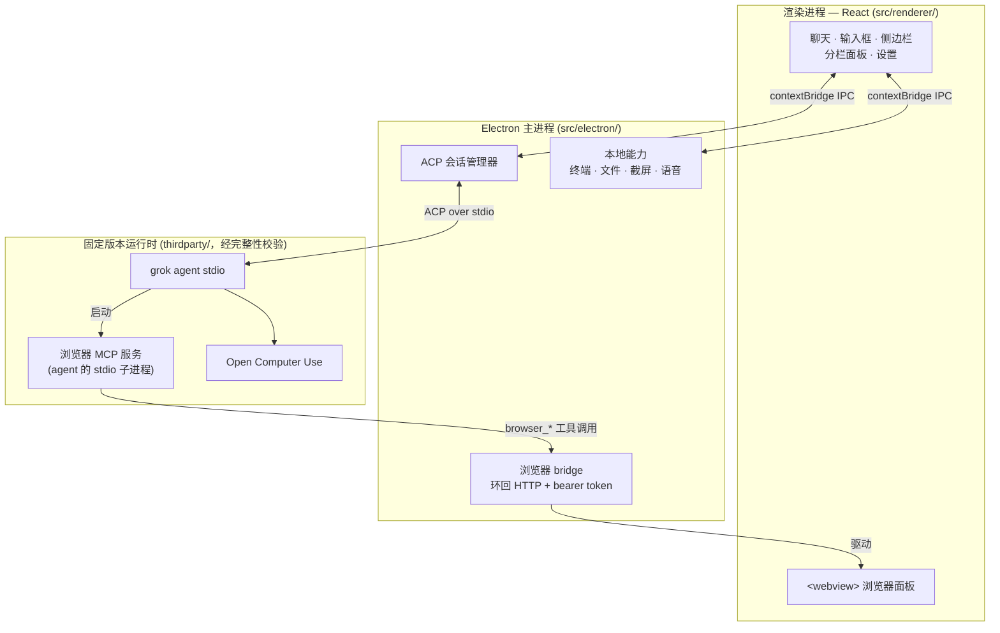

<h1 align="center">Grok Build GUI</h1>

<p align="center">
  <a href="https://x.ai/cli">Grok Build</a> 的桌面<strong>控制面板</strong>，
  通过 <a href="https://agentclientprotocol.com">ACP</a> 与本地
  <code>grok agent</code> 通信。
</p>

<p align="center">
  <a href="LICENSE"></a>
  
  
  
</p>

<p align="center">
  <a href="README.md">English</a> ·
  <strong>简体中文</strong>
</p>

---

Grok Build 本身是一个终端 agent。本应用在它前面放了一套真正的桌面界面——会话侧
边栏、带工具卡片的流式转录、权限弹窗、可供 agent 操作的内嵌浏览器、终端和文件
树——而不重新实现 agent 本身。

**它是客户端，不是第二个 agent。** 应用会还原一份固定版本、经过完整性校验的
`grok` 可执行文件，启动 `grok agent stdio`，并通过 ACP 驱动每一个会话。会话、
工具和循环的唯一事实来源始终是 agent；GUI 负责呈现、本地系统能力，以及 ACP 所
要求的人工审批界面。

## 功能

### 对话

- **流式转录**，支持按轮次导航、轮次轨道，以及回溯到指定位置。
- **工具卡片**可展开查看参数、结果和统一 diff，并有文件变更栏汇总本轮改动了
  哪些文件。
- **过程折叠**收起冗长的工具输出，让推理过程保持可读。
- **Markdown 与语法高亮**、内联图片附件，以及图片灯箱。
- **提示队列**——一轮对话进行中也可以继续输入并排队后续消息，或中途插话。
- **上下文计量表**将上下文窗口拆解为缓存前缀、新输入、回复、思考 token 和剩余
  空间。

### Agent 控制

- **权限弹窗**实现了 ACP 的 `request_permission` 反向请求：agent 发起询问，你
  逐次允许或拒绝。
- **权限模式**从逐项审批到完全放行（YOLO），在输入框处选择并始终可见。
- **模型与推理强度选择器**，由能力探测填充，而不是硬编码的版本经验。
- **斜杠命令与技能**——`/browser`、`/computer`、`/goal`，以及所连接 agent 及其
  插件提供的其他命令。
- 可随时**取消**进行中的对话轮次。

### 可供 agent 操作的内嵌浏览器

聊天区旁边是一个 `<webview>` 面板，应用把它作为 MCP 工具服务暴露给 agent：
`browser_open`、`browser_navigate`、`browser_snapshot`、`browser_click`、
`browser_fill`、`browser_press_key`、`browser_scroll`、`browser_screenshot`、
`browser_wait_for`。

每一步操作你都能亲眼看到。填写 `type="password"` 字段时一律停下来请求显式批准，
且密文在展示或记录之前就已从权限载荷中抹除。

### 本地能力

- **终端**——真实 PTY 会话（`node-pty` + xterm.js），可配置 shell 与明暗主题。
- **文件树与查看器**，带右键菜单、在访达中显示，以及"打开方式"。
- **屏幕捕获**——整屏、窗口或拖拽选区（支持多选区），带编辑器，可直接作为附件
  进入输入框。
- **语音输入**——按住说话的语音转文字，语音语言可选。
- **侧任务**与分栏面板，让终端、文件或第二个任务与对话并排显示。

### 会话与工作区

- **会话按项目分组**，可搜索、重命名、恢复，加载时历史会流式回填。
- **Git worktree 隔离**——可以从任意分支为一次对话单独开一个 worktree，让 agent
  的改动完全不碰你的工作副本；应用会跟踪状态并负责清理。
- **工作区选择器**，包含最近项目和一次性任务工作区。

### 账号与平台

- 通过 CLI 的 OAuth 流程**登录 Grok**，并显示账号与用量/配额。
- **插件管理**——列出、安装、启用、停用、卸载。
- **界面语言**：英文、简体中文，或跟随系统。
- **自动更新**，来源可以是 GitHub Releases 或任意静态更新源，按构建选择启用。
- **系统代理探测**、窗口状态持久化，以及原生应用菜单。

## 架构



**渲染进程 → 主进程。** 渲染进程不持有任何特权句柄。所有操作——agent 提示、终
端字节流、文件读取、屏幕捕获——都要穿过 `contextBridge` 预加载层进入主进程。

**主进程 → agent。** 主进程启动固定版本的 `grok agent stdio`，并通过它的 stdio
管道讲 ACP。会话状态、工具执行和目标循环都在 agent 里；GUI 负责渲染更新和回应
权限请求。

**Agent → 浏览器。** 主进程在随机端口上启动一个环回 HTTP bridge，配一个随机的
32 字节 bearer token，然后把一份 MCP 服务描述交给 agent。agent 将该 MCP 服务作
为自己的 stdio 子进程启动；该子进程再把 `browser_*` 调用经由带鉴权的环回 bridge
转发回来，最终驱动你正在观看的 `<webview>`。agent 从不直接接触渲染进程。

**两层安全。** 应用权限（ACP `request_permission` → GUI 弹窗）是本应用负责实现
的那一层。可选的操作系统沙箱（Seatbelt/Landlock）由 agent 强制执行，违规时直接
以 `EPERM` 硬失败——它没有供人工授权的回调，界面也绝不假装它有。

设计规则与视觉契约见
[docs/architecture/PROJECT_CHARTER.md](docs/architecture/PROJECT_CHARTER.md)。

> 说明：`docs/` 下的文档按项目章程统一使用英文。

## 环境要求

- Node.js 22.12+
- 开发与当前打包发布需要 Apple Silicon 的 macOS
- 开发也支持 x64 或 ARM64 的 Windows 10/11

Grok Build 运行时清单中已为 Linux x64 和 ARM64 预留了平台标识，但在补齐并验证
固定的构件 URL、大小和 SHA-256 之前，Linux 仍不受支持。

## 初始化与运行

在 macOS 上克隆仓库后运行：

```bash
./bootstrap
```

```bash
npm run dev
```

一条命令完成依赖准备并启动应用：

```bash
./bootstrap --start
```

在 Windows 的 PowerShell 或命令提示符中运行：

```powershell
.\bootstrap.cmd
```

```powershell
npm.cmd run dev
```

一条命令完成依赖准备并启动应用：

```powershell
.\bootstrap.cmd --start
```

即使 PowerShell 执行策略禁止运行本地脚本，`bootstrap.cmd` 仍然可用。允许运行本
地 PowerShell 脚本的环境也可以使用 `bootstrap.ps1`，它接受 `-Start` 参数。

`bootstrap` 会安装锁定的 npm 依赖，并还原 `config/runtime/` 中声明的确切运行时
版本。下载的运行时文件放在 `thirdparty/` 下，且永不提交。

常用检查：

```bash
npm test
```

```bash
npm run typecheck
```

```bash
npm run artifacts:verify
```

## 受管运行时依赖

- `thirdparty/grok-build/<version>/` 包含固定版本的 Grok 可执行文件和许可证声
  明。该发布版可执行文件是应用运行所必需的，并会被嵌入打包后的应用。
- `thirdparty/open-computer-use/<version>/package/` 包含固定版本的 Open Computer
  Use 包，同样会嵌入打包后的应用。
- `thirdparty/open-computer-use/LICENSE` 被纳入版本控制，因为它必须随 Open
  Computer Use 的再分发一同提供。

应用只会在开发期间自动探测这些由项目管理的依赖，在打包构建中则使用对应的内置资
源。下载得到的 Grok Build 和 Open Computer Use 二进制文件被忽略且绝不可提交；
`config/runtime/` 中被跟踪的清单才是确切版本与完整性哈希的事实来源。

## 打包

在 Windows x64 上构建未签名的 NSIS 安装包：

```powershell
npm run package:win
```

安装包输出到 `out/release/Grok-Build-GUI-<version>-win-x64-setup.exe`。

在 Apple Silicon 的 Mac 上构建 macOS DMG：

```bash
./scripts/package-dmg --preview
```

```bash
./scripts/package-dmg
```

preview 命令生成用于本地验证的 ad-hoc 签名 DMG。默认命令生成经 Developer ID 签
名、公证并装订（stapled）的发布版 DMG。两种流程都会在打包前还原清单中固定的运行
时依赖，并将其包含进最终的应用包。

签名者信息不进仓库：`MAC_SIGNING_IDENTITY` 和 notarytool 配置都来自环境变量，因
此任何克隆都用自己的证书签名。配置方法见
[docs/process/MAC_RELEASE.md](docs/process/MAC_RELEASE.md)，其中也介绍了可以让你
的法定姓名不出现在构件里的自签名方案。

## 仓库结构

- `src/renderer/`：React、样式、渲染层状态与渲染层测试。
- `src/electron/`：Electron 主进程、preload、ACP，以及本地系统集成。
- `config/`：Vite、TypeScript、Electron Builder 配置与固定的运行时清单。
- `resources/`：纳入版本控制的应用图标、DMG 素材和 macOS entitlements。
- `scripts/`：依赖安装脚本与 DMG 发布命令。
- `docs/`：架构章程、流程指南与调研笔记。
- `out/`：被忽略的渲染层、Electron、应用与 DMG 构建产物。
- `thirdparty/`：被忽略的、由 bootstrap 还原的固定运行时依赖。
- `tmp/`：被忽略的一次性上游源码树与调研材料。

克隆或解压的上游源码以及一次性调研产物请放在 `tmp/` 下。整个目录都被忽略，且必
须可以随时删除而不影响开发、测试、打包或应用启动。不要把上游源码快照、生成的依
赖包、构建产物、DMG、`.app` 包或设计预览图加入仓库。

## 文档

- [架构章程](docs/architecture/PROJECT_CHARTER.md)——产品边界、硬性规则、UI 模
  块化、视觉契约。
- [Agent 指南](docs/process/AGENT_GUIDELINES.md)——贡献者的修改纪律。
- [macOS 发布](docs/process/MAC_RELEASE.md)——签名与公证。
- [自动更新测试](docs/process/testing-auto-update.md)——三个验证层级。
- [后续计划](docs/process/NEXT_STEPS.md)——当前路线图。

## 许可证

GUI 部分采用 MIT 许可证，见 [LICENSE](LICENSE)。内置的 Grok Build 构件为
Apache-2.0，并随附其上游及第三方声明。Open Computer Use 0.2.1 为 MIT 许可证，
在打包分发中保留其许可证文件。
